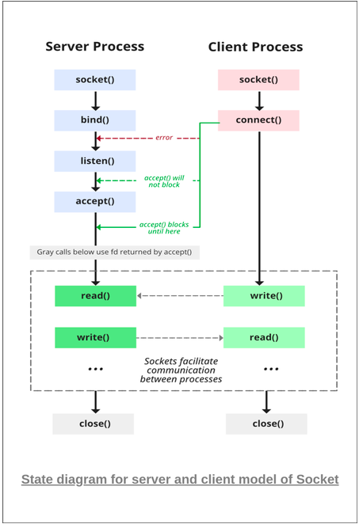

    

# Network programming

    - Socket -> (https://www.geeksforgeeks.org/socket-programming-cc/):
        - Socket programming is a way of connecting two nodes on a network to communicate with each other. One socket(node) listens on a particular port at an IP, while the other socket reaches out to the other to form a connection. The server forms the listener socket while the client reaches out to the server
    - Socket Architecture:
        -
# Some Code Explanation:
    - while creating a socket() we pass three arguments:
        - first argument:
            - AF_INET -> stands for Address Family – Internet and is used for IPv4-based network communication
# Reference :

    - [socket Tutorial](https://www.linuxhowtos.org/C_C++/socket.htm)
    - [geeksforgeeks](https://www.geeksforgeeks.org/socket-programming-cc/)